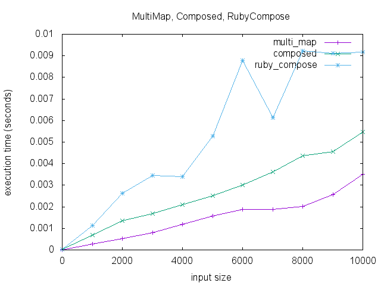

# compose
`Proc#compose` (`*`) C extension

# [graph::function](https://github.com/mooreniemi/graph-function)



# stackprof notes

```
stackprof compose.dump --text
==================================
  Mode: object(1)
  Samples: 10 (0.00% miss rate)
  GC: 0 (0.00%)
==================================
     TOTAL    (pct)     SAMPLES    (pct)     FRAME
        10 (100.0%)           9  (90.0%)     block in <main>
         1  (10.0%)           1  (10.0%)     block in <main>
        10 (100.0%)           0   (0.0%)     <main>
        10 (100.0%)           0   (0.0%)     <main>
```

```
stackprof multi_map.dump --text
==================================
  Mode: object(1)
  Samples: 4 (0.00% miss rate)
  GC: 0 (0.00%)
==================================
     TOTAL    (pct)     SAMPLES    (pct)     FRAME
         4 (100.0%)           3  (75.0%)     block in <main>
         1  (25.0%)           1  (25.0%)     block in <main>
         4 (100.0%)           0   (0.0%)     <main>
         4 (100.0%)           0   (0.0%)     <main>
```

```
stackprof funkify.dump --text
==================================
  Mode: object(1)
  Samples: 1000025 (0.00% miss rate)
  GC: 0 (0.00%)
==================================
     TOTAL    (pct)     SAMPLES    (pct)     FRAME
    800000  (80.0%)      800000  (80.0%)     block in Funkify#compose
   1000025 (100.0%)      200005  (20.0%)     block in <main>
        14   (0.0%)          14   (0.0%)     block (3 levels) in #<Module:0x007fd518866268>.auto_curry_some_methods
         3   (0.0%)           3   (0.0%)     Funkify#compose
         5   (0.0%)           2   (0.0%)     Proc#*
         1   (0.0%)           1   (0.0%)     block in <main>
   1000025 (100.0%)           0   (0.0%)     <main>
   1000025 (100.0%)           0   (0.0%)     <main>
```


